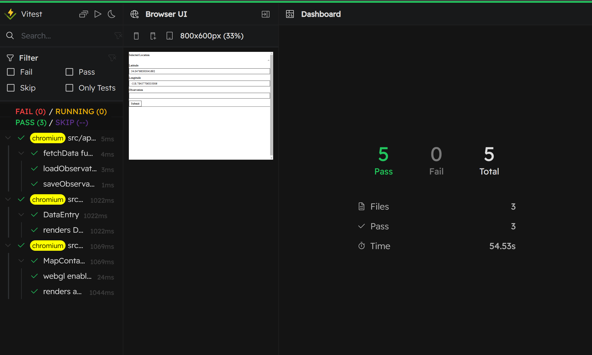

# ArcGIS Maps SDK for JavaScript: Testing for Success

This repository showcases best practices for testing the ArcGIS Maps SDK for JavaScript. It includes a lightweight React application featuring an interactive ArcGIS map and a DataEntry tab. The map listens for user click events, places an 'X' marker at the clicked position, and extracts latitude and longitude. These coordinates are then displayed in the DataEntry tab, allowing users to store their observations directly on the map.


**Testing Methodologies**

This repository covers various testing methodologies, including:

- Unit testing
- Integration testing
- End-to-end testing
- Visual regression testing

To support diverse testing environments, we utilize different frameworks, allowing flexibility in choosing the most suitable tool for your needs:

- Vitest
- Storybook
- Playwright

Beyond test implementation, we provide strategies to optimize test performance—reducing execution time and network calls—and enhance workflows and team collaboration using GitHub Actions.

## Types of testing

### Unit Testing

Tests for individual functions, components, or modules in isolation to ensure they work as expected. Our app consists of two components, [src/components/MapContainer](src/components/MapContainer.tsx) and [src/components/DataEntry.tsx](src/components/DataEntry.tsx). In addition, network request logics are stored under [src/api/](/src/api/).

#### Vitest

We use [vitest](https://vitest.dev/guide/) as our unit testing framework. Vitest is a modern, fast alternative to Jest, optimized for Vite projects. Since our application is built with vite, integrating vitest was seamless. You can find our Vitest configuration [here](https://vitest.dev/config/).

You can declare test configuration either in [vite.config.ts](vite.config.ts) or vitest.config.ts.

We configured it to check files under **src** directory. Each component and api request libraries are tested in isolation.

The configuration checks all the test files under 'src' directory. We set up tests for each components to be unit-tested in isolation. In here, vite provided many great tools such as running in browser mode and integrating mock services.

Vitest offers useful features like in-browser testing and mock service integration. Run tests with:

- Headless mode: `npm run test`
- Interactive UI: `npm run test:ui`



### Integration Testing

Tests that components like [DataEntry](/src/components/DataEntry.tsx) and [Map Container](/src/components/MapContainer.tsx) function together correctly, overlapping with E2E testing in scope.

### End To End (E2E) Testing

Simulates real user interactions by testing the entire application flow from start to finish.

To demonstrate integration and E2E testing, we utilize Storybook.

#### Storybook

Storybook is a powerful tool for building, testing, and documenting components in isolation. It allows independent UI development without backend dependencies, making it easier to validate UI states, styles, and interactivity.

Storybook supports useful addons for testing:

- Accessibility testing: `@storybook/addon-a11y`
- Visual regression testing: Chromatic
- Interaction testing: `@storybook/testing-library` and `@storybook/jest`

To try our storybook:

```sh
$ npm install
$ npm run storybook
```

Once loaded, navigate to the **Data Entry** → **Test** story. You’ll see **"This tests observation"** being typed into the input field automatically.

Using the `@storybook/addon-interactions` addon, we ran browser-based E2E tests to ensure components load correctly, handle properties, and submit data properly.


### Visual Regression

Ensures UI consistency by detecting unintended changes. It captures and compares screenshots before and after code updates to highlight discrepancies, preventing unwanted design or layout shifts.

### Playwright

Playwright is a powerful tool for E2E and visual regression testing, supporting Chromium, WebKit, and Firefox without requiring manual version updates.

In our [demo](/__tests__/DataEntry.test.ts), we:

1. Render our application
2. Click the center of the map
3. Capture a screenshot of the **DataEntry** tab
4. Compare it with the [screenshots/data-entry.png](screenshots/data-entry.png)

> A difference of 5% or more results in a test failure.

To run visual regression:

```sh
$ npm install
$ npm run test:visual
```

## Optimization

Optimizing test execution helps reduce total testing time while maintaining accuracy. Here are key optimization techniques:

- **Mock Services**: Replace network calls with local mocks. For example, we mock ArcGIS API requests, cutting test times from minutes to seconds in Vitest.
- **Image Hashing**: In visual regression, compute image hashes locally and upload only if they differ from the server’s, minimizing network overhead.
- **Test Sharding**: Split large test suites across multiple VMs to run in parallel, drastically reducing total execution time.

## CI

Integrating tests into a CI pipeline ensures code quality, prevents regressions, and improves collaboration by providing real-time feedback to developers.

Some popular tools are:

- **GitHub Actions** – Simple, maintainable, and widely supported with built-in actions.
- **Jenkins** – A flexible, open-source automation server for building, testing, and deploying applications.

In our demo, we used Github Actions. The workflow is set up to run:

1. Clone the repository
2. Run tests (unit, integration, E2E, and visual regression)
3. Report test results directly on the pull request
4. Notify developers of failures through comments

**Collaboration & Notifications in CI**

A well-structured CI pipeline not only ensures quality but also improves team collaboration through automated notifications:

- **GitHub PR Comments** – Our Test Workflow posts test results as a comment on the PR, giving instant feedback to developers.
- **Slack or Teams Integration** – CI pipelines can be configured to send test reports or alerts to Slack, Microsoft Teams, or other messaging platforms, keeping teams informed.
- **Email Notifications** – Alerts can be sent to team members when a test fails or requires attention.
- **PR Status Checks** – GitHub prevents merging if tests fail, enforcing code quality.

Listed here are some useful actions provided from Github itself.

- **actions/checkout** – Clones the repository so workflow jobs can access and modify files
- **actions/setup-node** – Sets up a Node.js environment with caching
- **actions/github-script** – Runs JavaScript within workflows for automation tasks
- **slackapi/slack-github-action** – Sends notifications to Slack channels
- **rtCamp/action-slack-notify** – Posts test results to Slack

Advantages of GitHub Actions:

- Prevents merges if tests fail
- Integrates with GitHub’s API for automated PR management
- Supports retries for failed workflows
